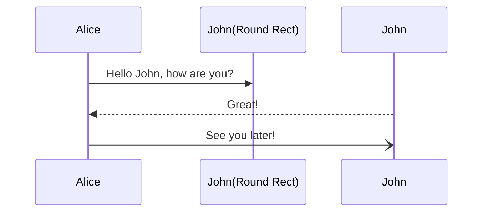

# Intro
  ### There are situation that we want to display secret data only for the users that are logged in. When server sets the sessionId cookie or responds with JWT token in header that session information will be carried with every subsequent call. Now the react tree has to determine on server site if the suer is authoriezed to see the content by verifing the cookie or JWT token either by:
  - 
  
